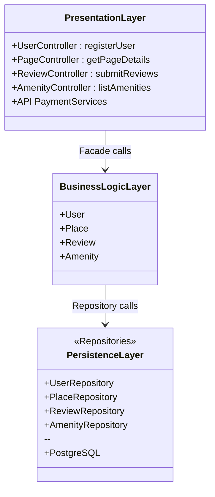

## Explanatory Notes

This high-level package diagram illustrates the three-layer architecture of the HBnB application.
The **Facade Pattern** streamlines the communication between layers.

---

### 🖥️ **Presentation Layer (Services, API)**

- **Purpose**:
- **Key Roles**:
- **Components**:
- **Facade Role**:

---

### 🔗 **Business Logic Layer (Models)**

- **Purpose**: core of the HBnB application
- **Key Roles**:
  - Define business rules, workflows and validation
  - Represent entities (`User`, `Place`, `Review`, `Amenity`)
  - Coordinate between `Presentation` and `Persistence` Layers
- **Components**:
  - **User Model**: handles user details, authentication and relations
  - **Place Model**: contains rental listings and their attributes
  - **Review Model**: manages feedback, ratings, constraints
  - **Amenity Model**: defines features like wi-fi, swimming pool, saunas, cinema room
- **Facade Role in Business Logic Layer**:
  - **Simplified access**: provides a **unified interface**, so the `Presentation` layer doesn't have to deal with internal complexities (multiple models, business logic)
  - **Consistency and flexibility**: keeps rules and validations in one place, so changes in models don't break external layers

---

### 🗂️ **Persistence Layer (Database)**

- **Purpose**:
- **Key Roles**:
- **Components**:
- **Facade Role**:

---

## High-Level Package Diagram

