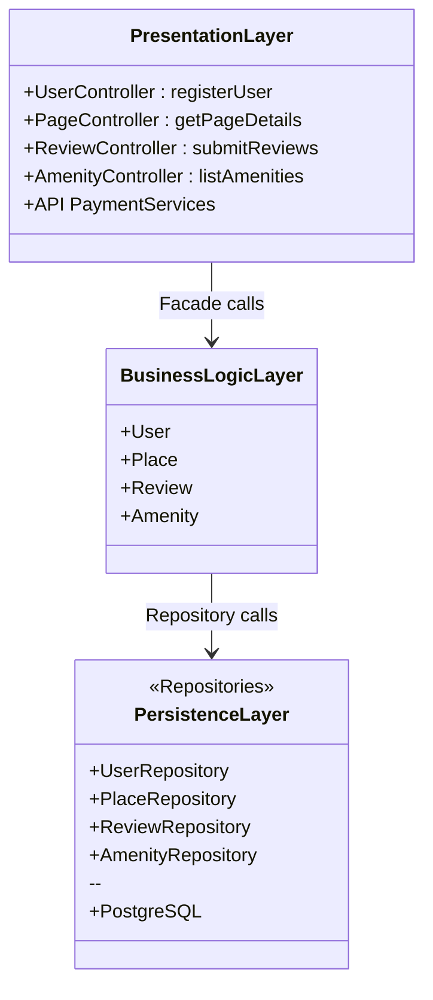

## Explanatory Notes

This high-level package diagram illustrates the three-layer architecture of the HBnB application.
The **Facade Pattern** streamlines the communication between layers.

---

### 🖥️ **Presentation Layer (Services, API)**

- **Purpose**: primary interface between the HBnB application and its users. 
- **Key Roles**:
  - User Interaction Management.
  - Provides APIs so users can search for places, add reviews or manage bookings.
  - Sending data back in a clear format (like JSON).
  - Error management with clear error messages when issues arise.
- **Components**:
  - **Service Handlers**: responsible for implementing the logic that responds to API calls (UserSerive, PlaceService, ReviewService, AmenityService).
  - **Controllers/API Endpoints**: defines the routes and HTTP methods (GET, POST, PUT, DELETE) for interacting with the application.
  - **Data Transfer Objects**: structure and validate the data exchanged between the clients and the applictaion.
- **Facade Role**:
  - **Unifies Access**: offers a single point of entry for business operations, reducing coupling between layers.
  - **Reduces Complexity**: presentation layer doesn't need to manage multiple models (clean and easy to manage).
  - **Improves Maintainability**: changes within the Business Logic Layer do not affect the external API structure.
  - **Enhances Consistency**: ensures that business rules and validations are applied.

---

### 🔗 **Business Logic Layer (Models)**

- **Purpose**: core of the HBnB application
- **Key Roles**:
  - Define business rules, workflows and validation
  - Represent entities (`User`, `Place`, `Review`, `Amenity`)
  - Coordinate between `Presentation` and `Persistence` Layers
- **Components**:
  - **User Model**: handles user details, authentication and relations
  - **Place Model**: contains rental listings and their attributes
  - **Review Model**: manages feedback, ratings, constraints
  - **Amenity Model**: defines features like wi-fi, swimming pool, saunas, cinema room
- **Facade Role in Business Logic Layer**:
  - **Simplified access**: provides a **unified interface**, so the `Presentation` layer doesn't have to deal with internal complexities (multiple models, business logic)
  - **Consistency and flexibility**: keeps rules and validations in one place, so changes in models don't break external layers

---

### 🗂️ **Persistence Layer (Database)**

- **Purpose**: Store and manage application data reliably, ensuring persistence across sessions.
- **Key Roles**:
  - Encapsulate all database interactions
  - Provide CRUD (`Create`, `Read`, `Update`, `Delete`) operations for entities (`User`, `Place`, `Review`, `Amenity`)
  - Enforce integrity rules (constraints, foreign keys, cascades)
  - Shield upper layers from SQL or database-specific implementation details
- **Components**:
  - **UserRepository**: handles queries for user accounts (create, getById, getByEmail)
  - **PlaceRepository**: manages rental properties (create, list with filters, attach amenities)
  - **ReviewRepository**: handles feedback retrieval and persistence
  - **Database (PostgreSQL)**: relational data storage, primary/foreign keys, constraints
- **Facade Role Architecture**:
  - Acts as the **data access layer** that the Business Logic Layer depends on
  - Provides a **clean contract** for data access so that any database changes (e.g., moving from PostgreSQL to another DB) do not affect external layers
  - Supports **transaction management** for complex operations (e.g., create Place + attach Amenities)

---

## High-Level Package Diagram

