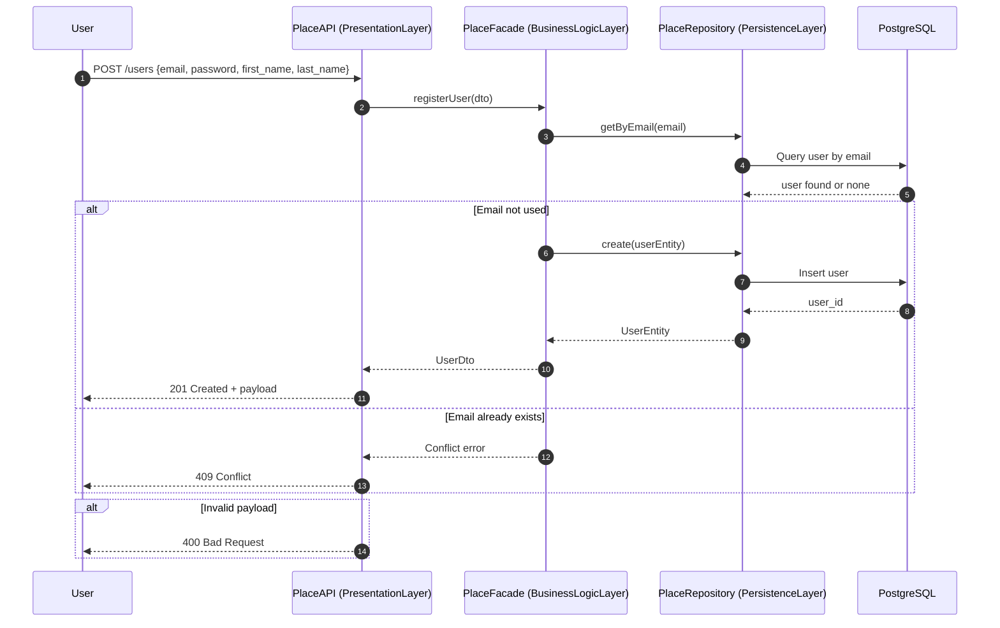
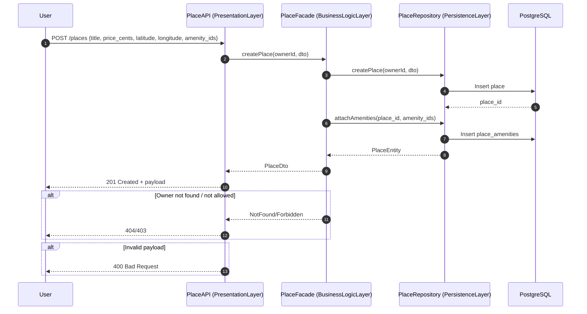
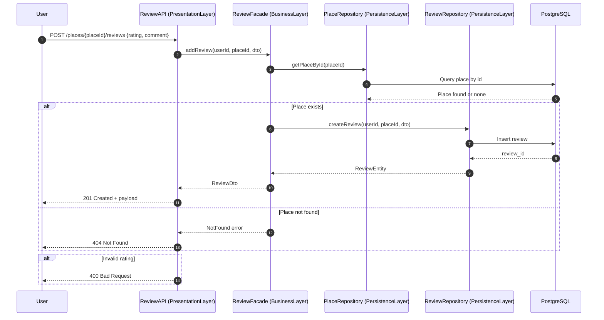
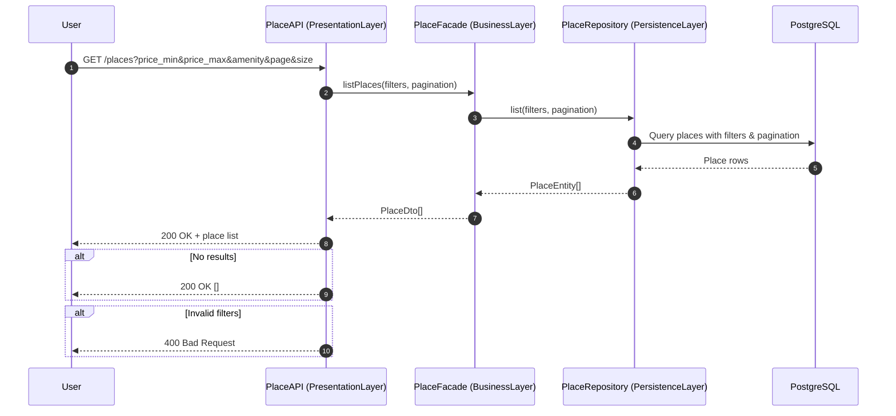

### 🖥️ **Sequence Diagrams for API calls**
---
- **Purpose**: 
  - The following 4 sequence diagrams illustrate how different components of the Hbnb application interact when handling user requests. Each diagram shows the **flow of information** across the `Presentation Layer` (API/controllers), `Business Logic Layer` (facades/services), and `Persistence Layer` (repositories/database).
  - The goal is to make the **request/response** lifecycle transparent, showing both the **happy path** (successful case) and **important error** branches (e.g., validation errors, not found, conflicts).
---
- **Included API Calls**
  - 1️⃣ **User Registration** (`POST /users`)
	- *What it does*: Allows a new user to sign up with `email`, `password`, and `personal details`.
	- *Flow*: User submits form → API validates → Business Logic checks email uniqueness → Repository inserts new record → DB saves → Response returns new UserDto.
	- *Error Cases*: Invalid payload (400), email already exists (409).
  - 2️⃣ **Place Creation** (`POST /places`)
	- *What it does*: Lets an authenticated user create a new rental property listing.
	- *Flow*: User calls API with place data → API forwards to Business Logic → BL opens transaction, saves place → attaches amenities via Repository → DB commit → Response returns PlaceDto.
	- *Error Cases*: Invalid data (400), not allowed (403), DB failure → rollback (500).
  - 3️⃣ **Review Submission** (`POST /places/{id}/reviews`)
	- *What it does*: Allows a user to leave a review for a place, including rating and comment.
	- *Flow*: User submits review → API forwards to BL → BL checks if place exists → Repository inserts review → DB saves → Response returns ReviewDto.
	- *Error Cases*: Place not found (404), rating out of range (400).
  - 4️⃣ **Fetching a List of Places** (`GET /places`)
	- *What it does*: Returns a paginated list of places, optionally filtered by price or amenities.
	- *Flow*: User sends query → API parses filters → BL forwards query to Repository → Repository builds SQL with joins → DB returns results → BL maps to PlaceSummaryDto → Response returns list.
	- *Error Cases*: No results (200 with empty list), invalid filters (400).
---
- **Key Roles of Sequence Diagrams**
  - **Presentation Layer**: Handles request/response, validates inputs, maps errors to HTTP codes.
  - **Business Logic Layer**: Implements rules, orchestrates transactions, and ensures data integrity.
  - **Persistence Layer**: Encapsulates DB access, executes queries, and returns entities to BL.
---
- **Why These 4 APIs?**
- **These APIs represent the core functionality of an Airbnb-like system:**
  - 1️⃣  **Register users** → build the user base

Purpose:
To register a new user in the system by collecting their credentials and storing them securely in the database.

Flow of Interactions:
1. *User* initiates a registration request via the frontend or API client.
2. *API Layer* receives the POST/users request and forwards it to the business logic.
3. *Business Logic Layer* validates the input and prepares the user data.
4. *Database Layer* stors the new user record.
5. A confirmation or error message is returned back through the layers to the user.
---

  - 2️⃣  **Create places** → supply side of rentals

Purpose:
To allow a registered user to create a new place listing with details like name, location and description.

Flow of Interactions:
1. *User* sends a POST/places request with place details.
2. *API Layer* receives the request and passes it to the business logic.
3. *Business Logic Layer* validates the place data.
4. *Database Layer* inserts the new place record.
5. A confirmation or error message is returned back through the layers to the user.
---  
  - 3️⃣  **Add reviews** → social proof and quality control

**Purpose**: To allow a user to leave a review for a place, including rating and comment.

**Flow of interation**:
1.	`User` submits a review with rating and comment.
2.	`ReviewAPI` validates input and forwards request to `Business Logic`.
3.	`Business Logic` checks that the place exists.
4.	If found, `ReviewRepository` inserts the review into the `database`.
5.	A new ReviewDto is returned to the user with `201 Created`.

**Error Cases**:
1. `404` Not Found: Place does not exist.
2. `400` Bad Request: Rating is outside allowed range (1–5) or payload invalid.
---
- 4️⃣  **Fetching places** → demand side for users searching listings

**Purpose**: Returns a paginated list of `places`, optionally `filtered` by price or amenities.

**Flow of interation**:
1.	`User` requests places with filters (price range, amenity, pagination).
2.	`PlaceAPI` parses query params and calls `Business Logic`.
3.	`Business Logic` forwards filters to the `PlaceRepository`.
4.	`PlaceRepository` queries the `DB` and returns matching places.
5.	Results are mapped to PlaceDto[] and returned with `200 OK`.

**Error Cases**:
1. 200 OK []: Valid query but `no results` match.
2. `400` Bad Request: Invalid filters (e.g. negative price, bad amenity value).
